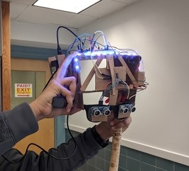

# Blind Helper HackPHSII
A mobile app assistant for blind people which uses OCR and object detection in order to help the blind person safely navigate their surroundings.

## Summary
Built a "helmet" that utilizes ultrasonic sensors to detect objects in the vicinity of a person. A mobile device can be attached that allows text to be read out loud using OCR (Optical Character Recognition).

## Demo

## Getting Started
Download and open in Android Studio